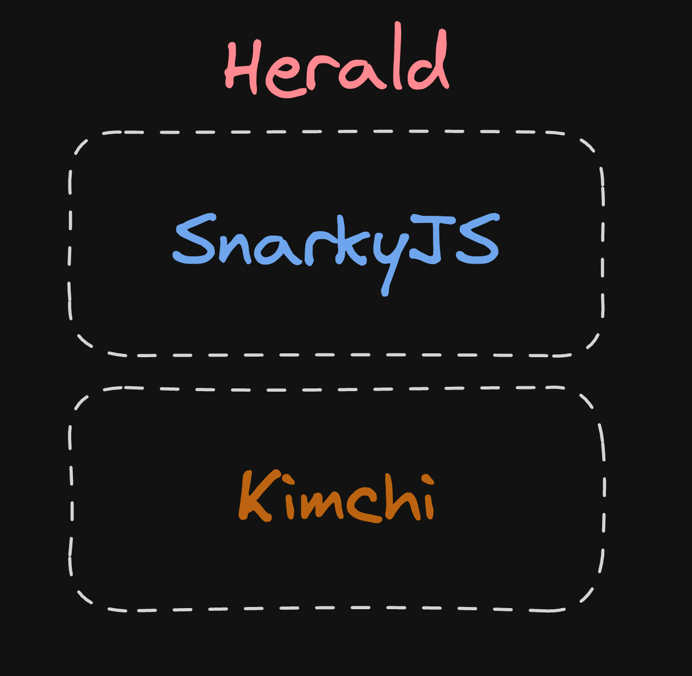

import { Callout } from 'nextra-theme-docs'

# 1) First title

## 2) Second title

## 3) Third title

## 4) Fourth title

## The Herald Stack

For now, let's focus on the high level overview and scrap the surface of each of these layers.

### Creating credentials

### Proving statements about credentials

<Callout type="default" emoji="🧩">
  One of the best features Herald offers thanks to being built with SnarkyJS is immediate integration with existing TypeScript applications. You can read more about it [here](https://docs.minaprotocol.com/zkapps/snarkyjs).
</Callout>

