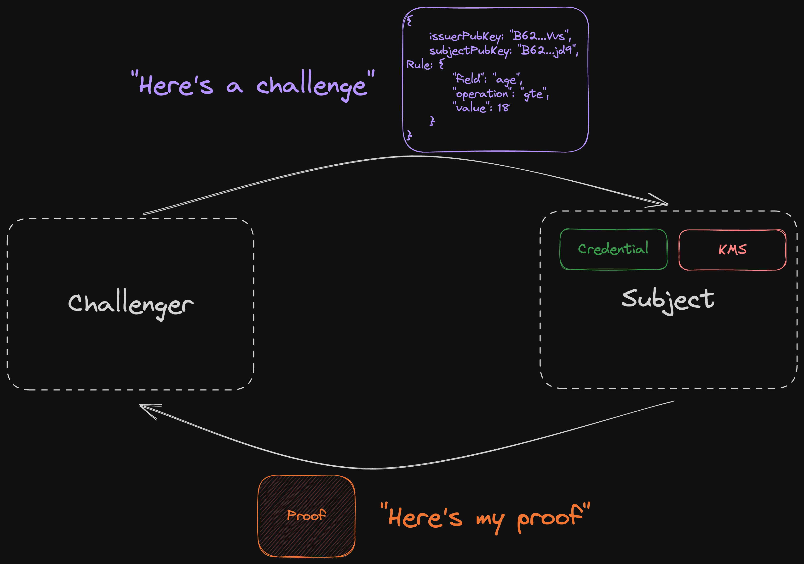
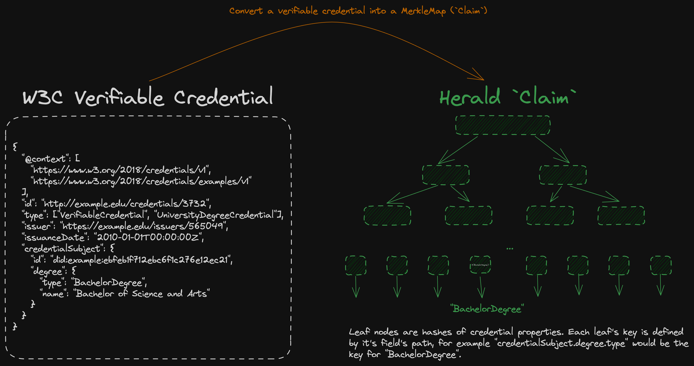

import { Steps } from 'nextra-theme-docs'

# Build upon Herald

This getting started guide includes:
- [**Creating a Basic Herald Credential**](#create-a-credential) - documents a simple credential creation.
- [**Creating a Basic Herald Challenge**](#create-a-challenge) - documents a simple challenge creation.
- [**Creating a Basic Herald Credential Proof**](#prove-your-credentials-can-satisfy-this-challenges-constraints) - documents how to satisfy challenge constraints and prove claims about an issued credential.
- [**W3C Credential Example**](#w3c-credential-example) - documents how to use the data model defined by W3C within Herald.
- [**CLI Credential Issuance Example**](##cli-credential-creation-example) - documents how to issue credentials via Herald's CLI.
- [**Subject Recreating Credential Example**](#recreating-a-credential) - documents how a subject can recreate their Herald credential after being issued a credential.


<Steps>

### Install dependencies

We first need to make sure you have everything needed to complete this tutorial.

| Dependency  |  Version | Installation |
|---|---|---|
| nvm  | latest  | `curl -o- https://raw.githubusercontent.com/nvm-sh/nvm/v0.39.3/install.sh \| bash` |
| Node.js | latest (through nvm) | `nvm install node` |
| TypeScript | latest | `npm install -g typescript` |
| snarkyjs | 0.11.* (as a peer dependency) | `npm install snarkyjs@0.11.*` |

### Create a credential
Let's create a credential for a subject who is 21 years old.
```ts
import { Credential } from @herald-sdk/credentials
import { PrivateKey } from "snarkyjs";
import { ClaimType } from "@herald-sdk/data-model";


// generate issuer private keys
const issuerPrvKey = PrivateKey.random();

// construct a claim about the subject
const claims: {[key: string]: ClaimType} = {
    age: 21, 
    subject: "B62qkAqbeE4h1M5hop288jtVYxK1MsHVMMcBpaWo8qdsAztgXaHH1xq"
};

// construct a credential using the claim and the issuer private key
const credential = Credential.create(claims, issuerPrvKey);
```

### Create a challenge
As a challenger, you want the subject to prove they meet some requirements like whether the subject is older than 18 and that a specific issuer has made this claim about the subject. Importantly, a challenger can also define a specific ZkProgram from `@herald-sdk/provable-programs` to further constrain the prover to an expected verification key.
```ts
import { Rule } from "@herald-sdk/data-model";
import { PublicInputArgs } from "@herald-sdk/provable-programs"

// what property of the credentials is the challenger challenging
const property = "age";
// what constraint does the subject need to prove; in this case that the "age" is greater than or equal to `value`
const operation = "gte";
// what value does the property "age" need to be greater than or equal to
const value = 18;
// create the `Rule`
const rule = new Rule(property, operation, value);

// create the challenge object
const issuerPubKey = "B62qn2bkAtVmN6dptpYtU5i9gnq4SwDakFDo7Je7Fp8Tc8TtXnPxfVv";
const subjectPubKey = "B62qkAqbeE4h1M5hop288jtVYxK1MsHVMMcBpaWo8qdsAztgXaHH1xq";
const challenge: PublicInputArgs = {issuerPubKey, subjectPubKey, provingRule: rule};
const zkProgram = "AttestSingleCredentialProperty";
```

Once the challenge has been created by the challenger, then they must give it to the prover, their interaction looks similar to the following diagram:




### Prove your credentials can satisfy this challenge's constraints
As a holder of a `Credential`, a subject can prove properties about their credentials given constraints. Note: the issuer public key needs to be assigned in the `Rule` (this is a TODO).
```ts
// given a rule and an expected issuer a holder of a `Credential` can `prove` properties of their credential
const proofResponse = await credential.prove("age", challenge, subjectPrvKey, zkProgram);
```

### Verify the Proof
As a challenger, you can verify whether the subject has satisfied your rule's constraints
```ts
import { verify } from 'snarkyjs'
import { ZkProgramsDetails } from '@herald-sdk/provable-programs'

// get verification key
const verificationKey = ZkProgramsDetails["AttestSingleCredentialProperty"].verificationKey

// verify the proof with a verification key
verify(proofResponse.toJSON(), verificationKey)
```
</Steps>

### W3C Credential Example
As the W3C verifiable credential data model defines, these JSON objects must be flattened to use in a `MerkleMap`. We can use the `flattenObject` function in `@herald-sdk/data-model` to do this! This is what happens:



A Herald `Claim` is just an abstraction over a SnarkyJS `MerkleMap`!

<Steps>
### Create credential for subject
Let's create a W3C example credential for a subject who has a Bachelor's Degree.
```ts
import { Credential } from @herald-sdk/credentials
import { PrivateKey } from "snarkyjs";
import { ClaimType, flattenObject, constructClaim } from "@herald-sdk/data-model";


// generate issuer private keys
const issuerPrvKey = PrivateKey.random();
// Define the credential
const credential = {
    "@context": [
        "https://www.w3.org/2018/credentials/v1",
        "https://www.w3.org/2018/credentials/examples/v1"
    ],
    "id": "http://example.edu/credentials/3732",
    "type": ["VerifiableCredential", "UniversityDegreeCredential"],
    "issuer": "https://example.edu/issuers/565049",
    "issuanceDate": new Date().toISOString(),
    "credentialSubject": {
        "id": "did:mina:B62qkAqbeE4h1M5hop288jtVYxK1MsHVMMcBpaWo8qdsAztgXaHH1xq",
        "degree": {
            "type": "BachelorDegree",
            "name": "Bachelor of Science and Arts"
        }
    }
}

// flatten the credential
const flattenedCredential = flattenObject(credential);

// construct a claim about the subject
const claims = constructClaim(flattenedCredential)

// construct a credential using the claim and the issuer private key
const credential = Credential.create(claims, issuerPrvKey);
```

### Construct Challenge
As a challenger you want to know if the credential a subject has is a Bachelor's Degree. We need a new `Rule` for this! Remember the credential's property is now a flattened object so the rule we create must check if the "credentialSubject.degree.type" property equals "BachelorDegree". The challenge is now an object that contains all constraints the prover must satisfy.

```ts
import { Rule } from "@herald-sdk/data-model";
import { PublicInputArgs } from "@herald-sdk/provable-programs";

const property = "credentialSubject.degree.type";
const operation = "eq";
const value = "BachelorDegree";

const rule = new Rule(property, operation, value);

// create the challenge object
const issuerPubKey = "B62qn2bkAtVmN6dptpYtU5i9gnq4SwDakFDo7Je7Fp8Tc8TtXnPxfVv";
const subjectPubKey = "B62qkAqbeE4h1M5hop288jtVYxK1MsHVMMcBpaWo8qdsAztgXaHH1xq";
const challenge: PublicInputArgs = {issuerPubKey, subjectPubKey, provingRule: rule};
const zkProgram = "AttestSingleCredentialProperty";
```

### Prove that the Credential can satisfy this Rule.
As the subject and credential owner, we can now make a proof using this challenge.
```ts
const proofResponse = await credential.prove("credentialSubject.degree.type", challenge, subjectPrvKey, zkProgram);
```

### Verify the Proof
As a challenger, you can verify whether the subject has satisfied your rule's constraints and the user does have a Bachelor's Degree, without revealing other information like the type of degree was a Bachelor of Science and Arts.
```ts
import { verify } from 'snarkyjs'
import { ZkProgramsDetails } from '@herald-sdk/provable-programs'

// get verification key
const verificationKey = ZkProgramsDetails["AttestSingleCredentialProperty"].verificationKey

// verify the proof with a verification key
verify(proofResponse.toJSON(), verificationKey)
```
</Steps>

### CLI Credential Creation Example

Herald's CLI credential issuance interface provides a seamless and convenient way for Issuers to generate verifiable credentials for subjects using Herald. The following documentation walks you through an example of using this interface.

```bash
pnpm run cli create --claims <CLAIMS_JSON> --issuerPrvKey <ISSUER_PRIVATE_KEY> --save <DIRECTORY_PATH>
```

- `<CLAIMS_JSON>`: This is a stringified JSON of your claims. Use `JSON.stringify(claims)` in your script to convert the claims object to a string.
- `<ISSUER_PRIVATE_KEY>`: The base58-encoded issuer's private key.
- `<DIRECTORY_PATH>`: Optional. The directory path where you want to save the generated artifacts. If not provided, it defaults to `./artifacts`.

In practice, if an Issuer is creating credentials for a subject they claim to have a university degree, executing the command might look something like this:

```bash
pnpm run cli create --claims '{"@context":["https://www.w3.org/2018/credentials/v1", "https://www.w3.org/2018/credentials/examples/v1"],...}' --issuerPrvKey EKE1nNTCEikFG6pn1NxqqN1TNjQXNrSZmMj6YSC9TefD7bJbGL15 --save ./artifacts/B62qk.../UniversityDegree
```

The directory path to save the artifacts can be customized to the Issuers' desired structure. The artifacts should be then given to the subject, or stored in a registry (e.g. a Data-Availability layer, smart contract, persistent store, etc.), the artifacts include:
- `signedClaim.json` (the issuer's signature of the MerkleMap root)
- `credential.json` (the JSON credential)
- `flatCredential.json` (the flatten credential required by subjects to reconstruct their Herald credential)  

### Recreating a Credential

If a subject has been issued credentials by an issuer, they can use Herlad to reconstruct their Herald Credential.

```ts
import { Credential } from @herald-sdk/credentials

// import the signed claim json object
const signedClaimJson = {
        "claimRoot": "17432993283620653071265435513179338119184224288853623637901748948712012685273",
        "signatureIssuer": {
          "r": "21180312343368474591313734714969702118628675012610691774369339245240369832750",
          "s": "22433867616914427848102713952217876822077837855966763038377768324812887427287"
        }
      };

// reconstruct the SignedClaim Struct
const signedClaim = new SignedClaim(undefined, undefined, signedClaimJson);

// construct a credential using the claim and the issuer private key
const credential = Credential.recreate(claims, signedClaim);
```